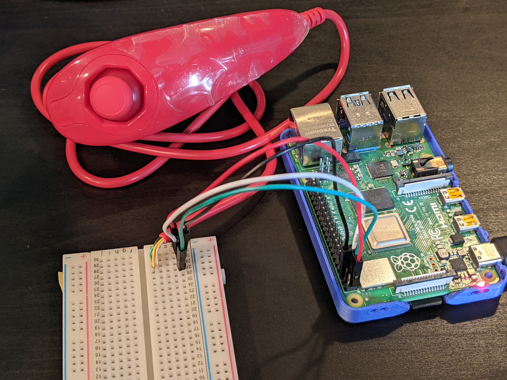

# nunchuk-read
A simple Python script that prints out data from a Nintendo Wii Nunchuk controller in real time. 

Background on Nunchuk I2C registers, handshake protocols, etc. were provided primarily through [Robert Eisele's detailed writeup](https://www.xarg.org/2016/12/using-a-wii-nunchuk-with-arduino/).


## Setup


### Software
This script was tested on a Raspberry Pi 4B and uses the [SMBus](http://wiki.erazor-zone.de/wiki:linux:python:smbus:doc) library, pre-installed on all non-lite versions of Raspberry Pi OS. It can be installed manually with:
```
sudo apt install python3-smbus python3-dev i2c-tools
```
And your nunchuk can be detected with:
```
sudo i2cdetect -y 1
```

### Wiring
Simply connect VCC, GND, SDA and SCL lines between Pi and nunchuk.
